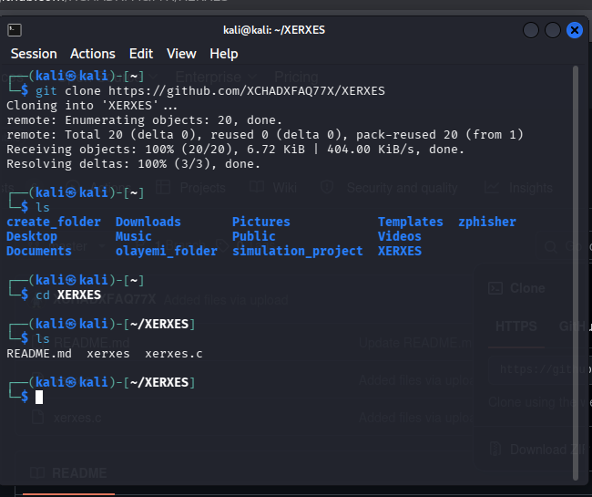
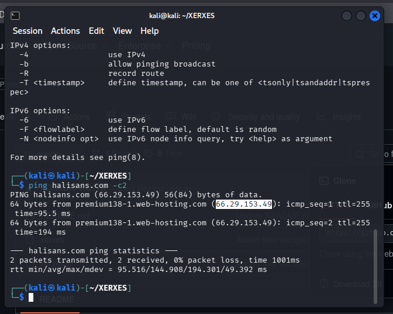
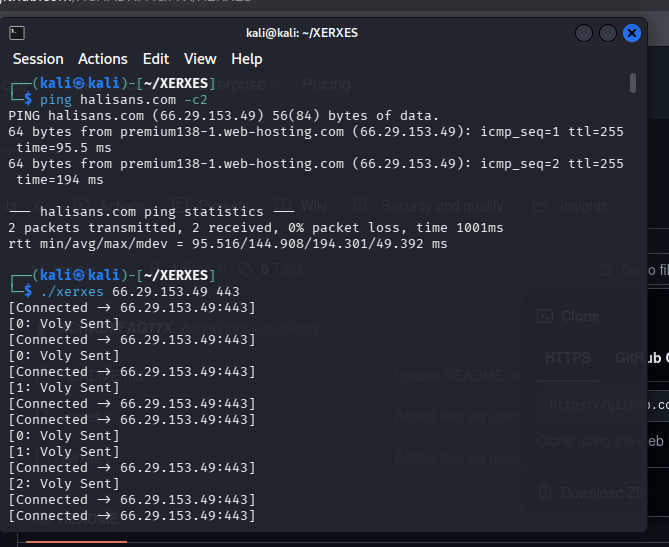
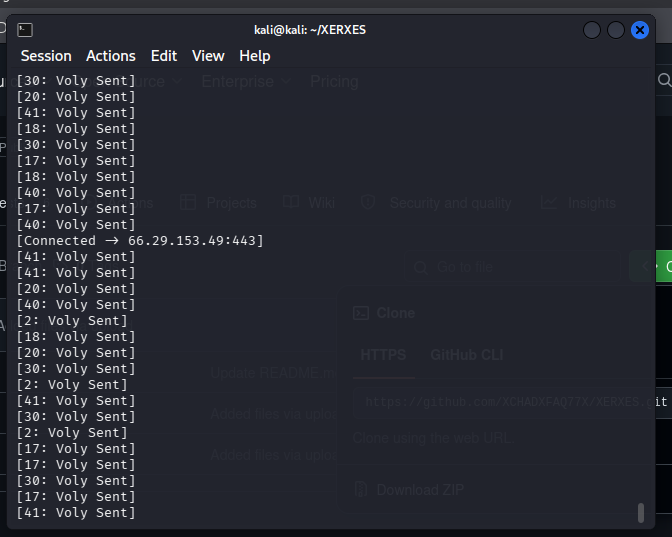
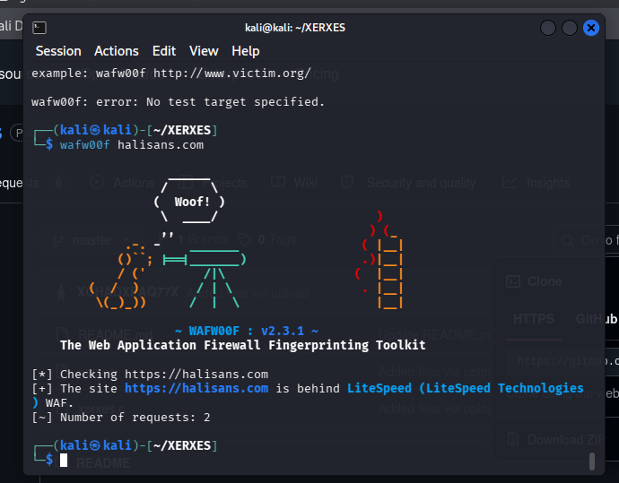
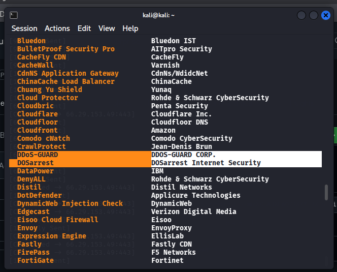
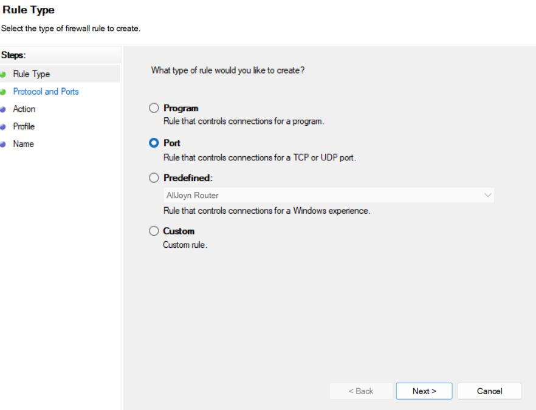
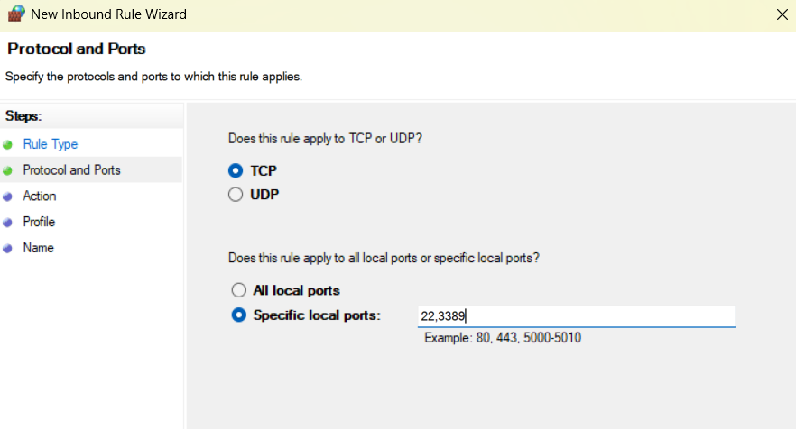
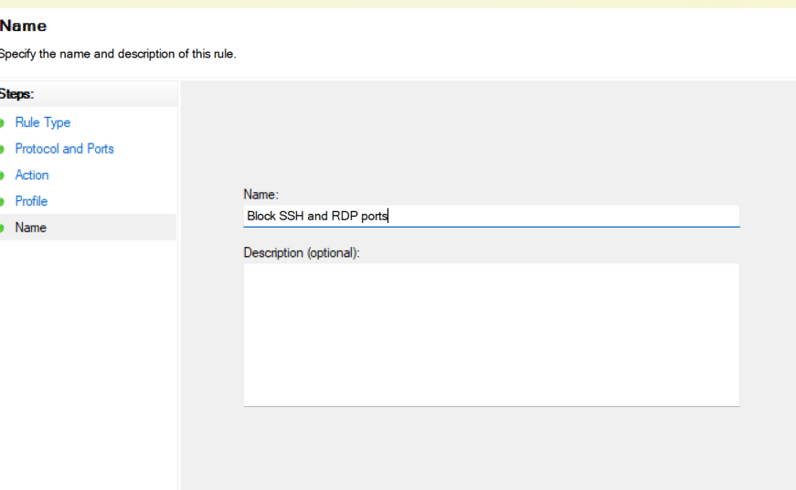
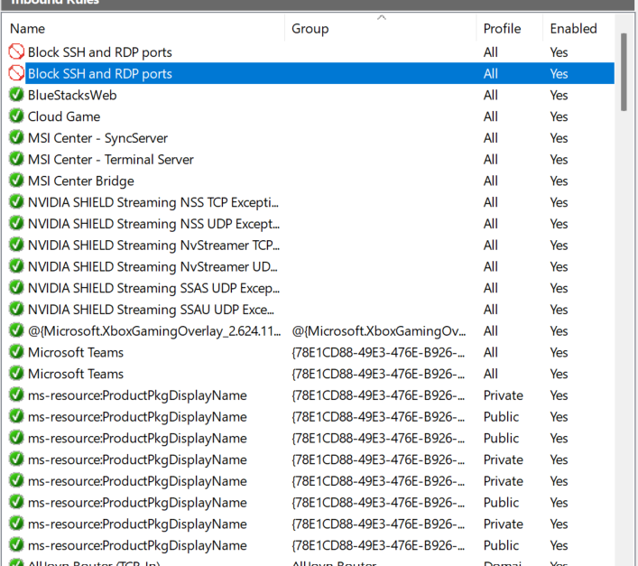

# DoS Traffic Observation, WAF Fingerprinting and Windows Firewall Hardening

An educational availability-security project using Kali Linux, Xerxes, wafw00f and Windows Defender Firewall with Advanced Security.

## Project Overview

This project documents three activities: observation of a single-source traffic-generation exercise, identification of a web application firewall signature, and configuration of Windows inbound firewall rules for administrative ports.

The screenshots demonstrate tool execution and firewall configuration. They do not establish a service outage, successful DDoS mitigation, or measured application resilience.

**Assessment context:** The exercise is described as authorized educational testing. Testing and publication must remain within the permission granted by the system owner. The Windows firewall demonstration is a separate local hardening activity; it is not evidence of a change to the remote web server.

## Objectives

- Understand availability risks associated with denial of service.
- Distinguish tool output from verified service impact.
- Identify a WAF signature using wafw00f.
- Configure inbound restrictions for selected Windows TCP ports.
- Document findings, evidence limitations and defensive recommendations.

## Tools and Environment

| Component | Role |
|---|---|
| Kali Linux | Workstation for the terminal-based exercise |
| Xerxes | Traffic-generation tool used in the recorded exercise |
| ping | Hostname resolution and basic ICMP reachability observation |
| wafw00f v2.3.1 | WAF fingerprinting and supported-product listing |
| Windows Defender Firewall with Advanced Security | Local inbound rule configuration |

## DoS and DDoS: Scope of This Exercise

Denial of service targets the availability of a system or service. Distributed denial of service involves coordinated activity from multiple sources.

The supplied evidence shows execution from one Kali Linux workstation. This report therefore describes a **single-source DoS exercise**, rather than a demonstrated distributed attack. The number of tool workers or connections does not establish multiple independent sources.

## Assessment Workflow and Evidence

### 1. Tool Preparation

The Xerxes repository was downloaded and its directory inspected. The listing contains `README.md`, `xerxes` and `xerxes.c`.

The screenshots establish repository retrieval and file inspection. They do not show a compilation command being executed.

### 2. Hostname Resolution and Reachability

The terminal shows a hostname resolving to an IPv4 address, followed by two successful ICMP replies and zero packet loss for that short sample.

This establishes basic reachability at that moment. It does not measure HTTPS availability, baseline throughput or resilience under load.

### 3. Traffic-Generation Output

Xerxes was executed against TCP port 443. The terminal reports connection messages and repeated `Voly Sent` output.

These messages show what the client tool reported. Their changing numeric values are not bandwidth measurements, response-time statistics or proof of firewall throttling. No server logs, packet captures or independent service-health measurements accompany the output.

### 4. WAF Fingerprinting

wafw00f reported the target as being behind **LiteSpeed (LiteSpeed Technologies)**. Its output reports two requests for this detection.

This is a tool-reported fingerprint. It does not verify the deployed configuration, rate-limiting policy or effectiveness against denial of service.

### 5. Supported WAF Product Review

The supported-product list was reviewed, including entries labelled DDoS-GUARD and DOSarrest.

The `wafw00f -l` option lists products the tool can detect. This list is not a recommendation, a performance comparison or evidence that any listed product protects the assessed target.

### 6. Windows Inbound Firewall Configuration

The Windows firewall wizard shows a **Port** rule with **TCP** selected and specific local ports **22,3389** entered. These are commonly associated with SSH and RDP respectively.

The rule was named **Block SSH and RDP ports**. The final list shows two enabled entries with this name, block icons and the profile value **All**.

The final screenshot demonstrates rule presence, not a successful connection-blocking test. The two same-name entries should be inspected to determine whether they are duplicates or have different settings. The TCP-port screenshot does not document a UDP rule.

## Findings and Evidence Boundaries

| Assessment area | Supported conclusion | Unverified outcome |
|---|---|---|
| Traffic generation | Client reported connections and sent activity on TCP 443 | Received traffic volume and service impact |
| Attack distribution | One workstation shown | Multiple independent traffic sources |
| WAF identification | wafw00f reported LiteSpeed | Exact configuration and mitigation effectiveness |
| Rate limiting | No direct measurement provided | Throttling or rate-limit enforcement |
| Application availability | No independent under-load check supplied | Maintained availability or outage |
| Windows hardening | Enabled block-rule entries shown | Effective blocking confirmed by connection tests |

No formal vulnerability severity or resilience score is assigned because the evidence does not establish exploitable impact or measured service performance.

## Defensive Recommendations

- Use provider-level DDoS protection and upstream filtering appropriate to the environment.
- Configure application-aware connection limits, timeouts and rate limiting where suitable.
- Monitor service health, connection counts, error rates and resource utilization.
- Restrict administrative access to approved management paths; disable unnecessary services.
- Review firewall rule direction, protocol, ports, profiles, action and scope.
- Inspect the two same-name rules and remove redundant entries only after confirming their settings.
- Retain logs and independent measurements to support future assessment conclusions.

A WAF and a local host firewall serve different purposes. Blocking administrative ports reduces exposure to those services but does not establish protection from upstream bandwidth exhaustion. A TCP-only rule also does not cover UDP traffic.

## Further Validation Needed

To establish resilience or control effectiveness in a separately approved assessment, collect:

| Evidence | What it would clarify |
|---|---|
| Baseline and during-test application health checks | Availability and response-time changes |
| Server, WAF and network logs | Received activity and control decisions |
| Recorded duration and traffic measurements | Scope and magnitude of the exercise |
| Firewall rule properties | Actual action, protocol, scope and profiles |
| Before-and-after connection tests | Whether the intended administrative access restriction works |

These validation activities are proposed next steps, not completed project results.

## Skills Demonstrated

- Linux terminal use and tool preparation
- Basic hostname resolution and reachability interpretation
- WAF fingerprint interpretation
- Windows inbound firewall configuration
- Availability-risk analysis
- Evidence-based assessment reporting

## Screenshot Handling

The screenshot filenames below are publication filenames. Rename the selected images to match before uploading them into `Screenshots`.

Before public upload, review target hostnames, IP addresses, personal directory names and unrelated browser tabs. The supplied images have not been redacted as part of this README revision. Retain original captures privately.

## References

- [wafw00f usage documentation](https://github.com/EnableSecurity/wafw00f/wiki/Usage)
- [Microsoft Windows Firewall rules](https://learn.microsoft.com/en-us/windows/security/operating-system-security/network-security/windows-firewall/rules)

## Author

**Olayemi Owoeye**  
Cybersecurity Portfolio  
[GitHub: Yem-Tech](https://github.com/Yem-Tech)
